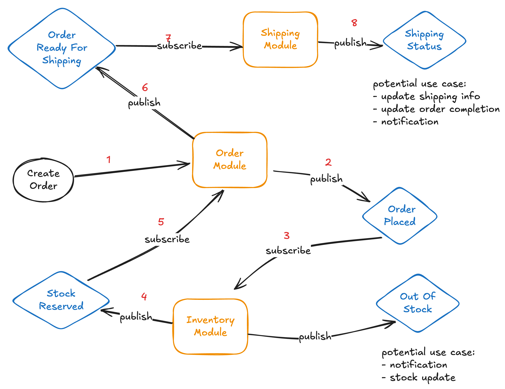

# Inventory, Order & Shipping

## Description

This project implements a simple inventory, order and shipping system. The system is designed to handle concurrent order requests and inventory changes. Each module is implemented as a separate service and communicates with each other using Event Sourcing.

### Diagram



1. Create Order **(Order Module)**
   - verify input data
   - store order data to DB
2. Publish to OrderPlaced
3. Subscribe to OrderPlaced **(Inventory Module)**
   - subscribe to OrderPlaced
   - check data stock
   - if item unavialble publish to OutOfStock
   - if item available update data stock
4. Publish to StockReserved
5. Subscribe to StockReserved **(Order Module)**
   - Update order & item status
   - if any item change to fullfilled publish to OrderReadyForShipping
6. Publish to OrderReadyForShipping
7. Subscribe to OrderReadyForShipping **(Shipping Module)**
   - Update order status
   - Create shipping label
   - Publish to ShippingStatus
8. Publish to ShippingStatus

## Overview

### Edge Case

-

### Design Choice

-

## Usage

### Installation

#### Prerequisites

- Node.js

#### Clone Repository

```bash
git clone https://github.com/dodysat/inorship.git
```

#### Install Dependencies

```bash
cd inorship
npm install
```

### Test

#### Generic Test

```bash
npm test
```

This will run all the tests in the project.

#### Concurrent Order Request

```bash
npm run test:concurrent
```

This will run the test for concurrent order requests. The test will create multiple order requests and check if the inventory is updated correctly. The test will also check if the order is created correctly.

#### Inventory Changes
