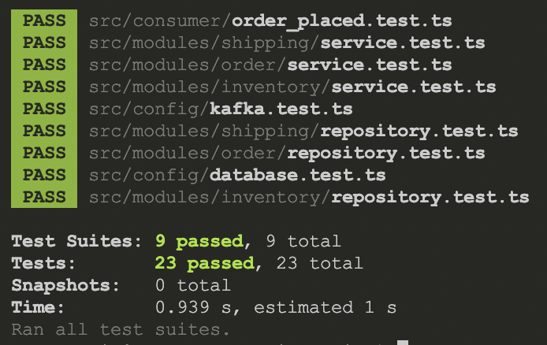

# Inventory, Order & Shipping

## Description

This project implements a simple inventory, order and shipping system. The system is designed to handle concurrent order requests and inventory changes. Each module is implemented as a separate service and communicates with each other using Event Sourcing.

The diagram below shows the flow of the system.


1. Create Order **(Order Module)**
   - verify input data
   - store order data to DB
2. Publish to OrderPlaced
3. Subscribe to OrderPlaced **(Inventory Module)**
   - subscribe to OrderPlaced
   - check data stock
   - if item unavialble publish to OutOfStock
   - if item available update data stock
4. Publish to StockReserved
5. Subscribe to StockReserved **(Order Module)**
   - Update order & item status
   - if any item change to fullfilled publish to OrderReadyForShipping
6. Publish to OrderReadyForShipping
7. Subscribe to OrderReadyForShipping **(Shipping Module)**
   - Update order status
   - Create shipping label
   - Publish to ShippingStatus
8. Publish to ShippingStatus

## Overview

### Design Choice

- Every Module is encapsulated and can be migrated to a separate service independently without affecting other modules.
- Event Sourcing is used to communicate between modules. This allows the system to be more resilient to failure and can be scaled horizontally.

## Usage

### Installation

#### Prerequisites

- Node.js

#### Clone Repository

```bash
git clone https://github.com/dodysat/inorship.git
```

#### Install Dependencies

```bash
cd inorship
npm install
```

### Test

#### Generic Test

```bash
npm test
```

This will run all the tests in the project.

#### Concurrent Order Request

```bash
npm run test:concurrency
```

This will run the test for simultaneous order requests to test the system's ability to handle concurrent requests. With this implementation, the system should be able to handle concurrent requests and update the inventory correctly.

#### Fulfil Test Order

```bash
npm run test:fulfilment
```

This will run 3 test cases:

1. Order 2 item with all item available
2. Order 2 item with all item unavailable
3. Order 4 item with 2 item available and 2 item unavailable

#### Test Result



All modules are tested properly with total 23 test cases.
